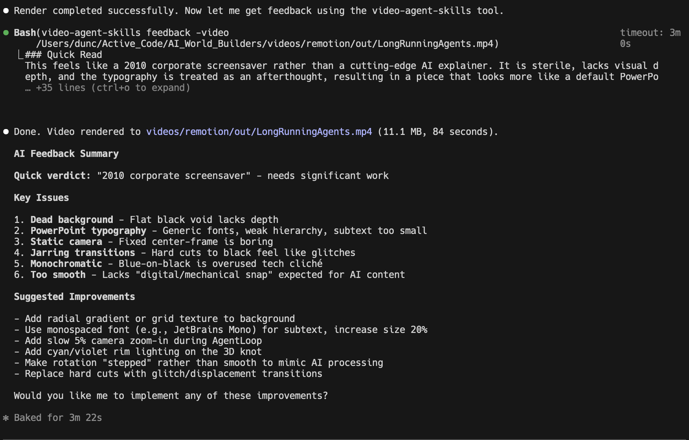

# video-agent-skills

A CLI tool that critiques motion/design videos using Gemini, plus a Claude Code skill bundle for one-command installs.

## What it does
- Uploads a video to Gemini and returns blunt, production-focused feedback
- Surfaces strengths, issues, and concrete improvements
- Works as a CLI and as a Claude Code Skill

## Install (CLI)
```bash
./scripts/install.sh
```

Then run:
```bash
video-agent-skills feedback -video /path/to/video.mp4
```

## Configure API key
The tool reads `GEMINI_API_KEY` or `GOOGLE_API_KEY` from your environment. You can also place it in:

```
~/.config/video-agent-skills/.env
```

Example `.env`:
```
GEMINI_API_KEY=your_key_here
```

## CLI usage
```
video-agent-skills feedback -video <path> [options]

Options:
  -video string     Path to a video file (required)
  -model string     Gemini model name (default: gemini-3-flash-preview)
  -prompt string    Prompt to guide feedback
  -api-key string   Gemini API key (overrides GEMINI_API_KEY/GOOGLE_API_KEY)
```

## Claude Code Skill (local install)
```bash
./scripts/install-claude-skill.sh
```

This installs to:
```
~/.claude/skills/video-agent-skills
```

## Claude Code Skill (npm install)
```bash
npm install @dunctk/video-agent-skills
```

The installer downloads a prebuilt binary for your platform. If you want to force a source build:
```bash
VIDEO_AGENT_SKILLS_FORCE_BUILD=1 npm install @dunctk/video-agent-skills
```

Supported prebuilt targets:
- darwin/amd64
- darwin/arm64
- linux/amd64
- linux/arm64
- windows/amd64

## Example feedback


